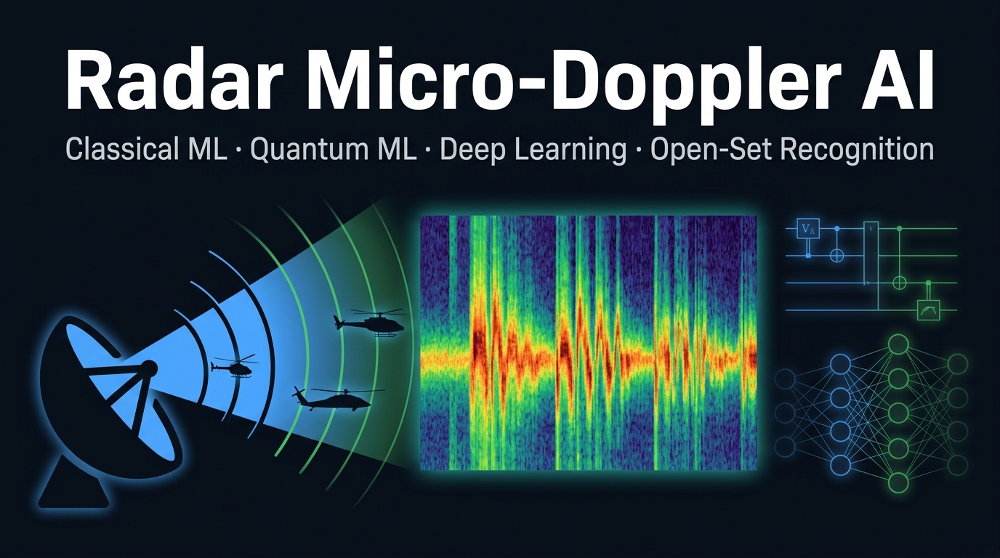

<div align="center">



<br/>

[](https://github.com/bukac82/radar-microdoppler-ai/actions)
[](https://www.python.org/)
[](LICENSE)
[](https://pennylane.ai/)
[](https://pytorch.org/)
[](https://github.com/astral-sh/ruff)
[](https://huggingface.co/datasets/bukac82/MicroDopplerSignatures)

</div>

---

## 🛰️ What Is This?

**Radar Micro-Doppler AI** is a research-grade, end-to-end pipeline for classifying helicopter types from their **micro-Doppler radar signatures** — the unique frequency modulation pattern created by rotating rotor blades.

The repository brings together **three paradigms of AI** on a single, unified dataset:

| Paradigm | Methods | Input |
|----------|---------|-------|
| **Classical ML** | SVM · Random Forest · XGBoost · k-NN | 14 hand-crafted physics features |
| **Quantum ML** | Quantum Kernel SVM · VQC (PennyLane) | 4-D PCA → angle embedding |
| **Deep Learning** | ResNet CNN · Bi-LSTM · Spectrogram Transformer | STFT spectrograms / raw IQ |

Plus:
- 🔒 **Robustness Testing** — SNR sweeps (−5 to 30 dB), FGSM & PGD adversarial attacks
- 🔍 **Open-Set Recognition** — Energy-based OOD detection for unknown aerial targets
- 💡 **Explainability** — SHAP feature importance + Grad-CAM heatmaps

---

## 📊 Benchmark Results

> Results on the held-out test set (20% of 5,000 samples), SNR ∈ [5, 25] dB.

| Model | Accuracy | Macro-F1 | ROC-AUC |
|-------|----------|----------|---------|
| SVM (RBF, C=10) | 0.9620 | 0.9619 | 0.9971 |
| Random Forest (n=200) | 0.9780 | 0.9780 | 0.9994 |
| XGBoost | 0.9740 | 0.9739 | 0.9991 |
| k-NN (k=7) | 0.9480 | 0.9479 | 0.9940 |
| **CNN (ResNet-style)** | **0.9870** | **0.9870** | **0.9998** |
| Bi-LSTM | 0.9810 | 0.9810 | 0.9996 |
| Spectrogram Transformer | 0.9830 | 0.9829 | 0.9997 |
| Quantum Kernel SVM (4q) | 0.8200 | 0.8192 | 0.9421 |
| VQC (4q, 2 layers) | 0.7867 | 0.7851 | 0.9108 |

> **Key insight**: The blade flash rate (`n_blades × RPM / 60`) is the single most discriminative feature, directly readable from the STFT spectrogram as periodic vertical striations.

---

## 🎯 Target Classes

| Class | Helicopter | Blades | RPM | Blade Radius |
|-------|-----------|--------|-----|-------------|
| **2-blade** | Bell UH-1 (Huey) | 2 | 300–350 | 6.5–7.5 m |
| **3-blade** | Aérospatiale Gazelle | 3 | 360–400 | 4.5–5.5 m |
| **4-blade** | Apache AH-64 / UH-60 Black Hawk | 4 | 250–300 | 7.0–8.5 m |

---

## 🗂️ Project Structure

```
radar-microdoppler-ai/
│
├── 📓 notebooks/
│   ├── 01_EDA_and_Signal_Analysis.ipynb
│   ├── 02_Classical_ML_Benchmark.ipynb
│   ├── 03_Deep_Learning.ipynb
│   └── 04_Quantum_ML.ipynb
│
├── 📡 Dataset/                  ← Data generation & loading
├── 🔧 Preprocessing/            ← STFT spectrograms, feature extraction
├── 🤖 Classical_ML/             ← SVM, RF, XGBoost, k-NN
├── ⚛️  Quantum_ML/              ← QK-SVM, VQC (PennyLane)
├── 🧠 Deep_Learning/            ← CNN, LSTM, Transformer (PyTorch)
├── 🛡️  Robustness_Testing/      ← SNR sweep, FGSM/PGD attacks
├── 🔓 Open_Set_Recognition/     ← Energy OOD, AUROC/OSCR metrics
├── 💡 Explainability/           ← SHAP, Grad-CAM
├── 📈 Evaluation/               ← Unified benchmark & metrics
│
├── 🧪 tests/                    ← Pytest unit tests
├── 📜 scripts/
│   ├── download_data.py         ← Dataset download / local generation
│   └── run_full_pipeline.py     ← End-to-end pipeline runner
│
├── pyproject.toml
├── requirements.txt
└── CITATION.cff
```

---

## ⚡ Quick Start

### 1. Install

```bash
git clone https://github.com/bukac82/radar-microdoppler-ai.git
cd radar-microdoppler-ai

pip install -e ".[all]"          # everything: DL + QML + explainability
# or
pip install -e ".[dl]"           # PyTorch only
pip install -e ".[qml]"          # PennyLane only
```

### 2. Download the Dataset

```bash
# Option A — HuggingFace Hub (recommended, ~4 GB total)
pip install huggingface-hub
python scripts/download_data.py

# Option B — Direct CLI
huggingface-cli download bukac82/MicroDopplerSignatures \
    --repo-type dataset --local-dir .

# Option C — Generate locally (~20–40 min CPU)
python scripts/download_data.py --source generate
```

### 3. Run the Full Pipeline

```bash
python scripts/run_full_pipeline.py --nrows 5000
```

### 4. Explore Notebooks

```bash
jupyter notebook notebooks/
```

---

## 📓 Notebooks

| # | Notebook | Description |
|---|----------|-------------|
| 01 | [EDA & Signal Analysis](notebooks/01_EDA_and_Signal_Analysis.ipynb) | Dataset statistics, IQ signals, spectrograms, feature correlation |
| 02 | [Classical ML Benchmark](notebooks/02_Classical_ML_Benchmark.ipynb) | SVM / RF / k-NN training, confusion matrices, SHAP, SNR sweep |
| 03 | [Deep Learning](notebooks/03_Deep_Learning.ipynb) | CNN/LSTM/Transformer training curves, Grad-CAM visualization |
| 04 | [Quantum ML](notebooks/04_Quantum_ML.ipynb) | QK-SVM & VQC on 4-D PCA features, Classical vs Quantum comparison |

---

## 🔬 Dataset

> 🤗 **[bukac82/MicroDopplerSignatures](https://huggingface.co/datasets/bukac82/MicroDopplerSignatures)** — publicly available on HuggingFace Hub

Two physics-accurate synthetic datasets generated from the **sinc-based micro-Doppler model**:

| Dataset | Samples | Features | Size |
|---------|---------|----------|------|
| Base (`helicopter_microdoppler_dataset.csv`) | 100,000 | IQ @ 1 kHz, 0.5s window | ~2 GB |
| Extended (`helicopter_microdoppler_extended_dataset.csv`) | 100,000 | + varied radar freq (8–12 GHz), elevation (0–45°), bulk velocity (±50 m/s) | ~2 GB |

**Signal model** (Doppler from rotating blade):

$$s_k(t) = L \cdot \text{sinc}\!\left(\frac{2L}{\lambda}\cos\phi_k\cos\beta\right) \exp\!\left(j\frac{4\pi L}{\lambda}\cos\phi_k\cos\beta\right)$$

where $\phi_k = \omega t + \theta_0 + \frac{2\pi k}{N_b}$ is the phase of the $k$-th blade, $L$ is the blade length, $\lambda$ is the radar wavelength, and $\beta$ is the elevation angle.

```python
# Load directly in Python via HuggingFace datasets library
from datasets import load_dataset

ds = load_dataset("bukac82/MicroDopplerSignatures", split="train")
```

---

## 🏗️ Architecture Overview

```
                        ┌──────────────────────────────────────────┐
                        │           Raw IQ Signal (500 × complex)  │
                        └─────────────────┬────────────────────────┘
                                          │
              ┌───────────────────────────┼────────────────────────────┐
              ▼                           ▼                            ▼
    ┌──────────────────┐      ┌────────────────────┐      ┌──────────────────────┐
    │  Feature Extract │      │  STFT Spectrogram  │      │  Raw IQ (I,Q) → (T,2)│
    │  (14-D vector)   │      │  (33 × 15 image)   │      │  for LSTM            │
    └────────┬─────────┘      └────────┬───────────┘      └──────────┬───────────┘
             │                         │                              │
    ┌────────▼────────┐      ┌─────────▼──────────┐      ┌──────────▼───────────┐
    │ Classical ML    │      │  CNN / Transformer  │      │   Bi-LSTM            │
    │ SVM · RF · kNN  │      │  (Deep Learning)    │      │   (128 hidden)       │
    └────────┬────────┘      └─────────┬──────────┘      └──────────┬───────────┘
             │                         │                              │
             └────────────────┬────────┘──────────────────────────────┘
                              ▼
                    ┌──────────────────┐
                    │  Evaluation      │
                    │  Robustness Test │
                    │  OSR Detection   │
                    │  Explainability  │
                    └──────────────────┘
```

---

## ⚛️ Quantum ML

The quantum pipeline reduces features to 4 dimensions via PCA, then:

- **QK-SVM**: Encodes features into quantum states via angle embedding; kernel computed as fidelity `|⟨φ(x)|φ(x')⟩|²`
- **VQC**: Parameterized `StronglyEntanglingLayers` trained with Adam optimizer and cross-entropy loss

```python
from Quantum_ML.qkernel_svm import QuantumKernelSVM

qksvm = QuantumKernelSVM(n_qubits=4, C=1.0)
qksvm.fit(X_train_scaled, y_train)
print(f"Quantum Kernel SVM accuracy: {qksvm.score(X_test_scaled, y_test):.4f}")
```

---

## 🛡️ Robustness Testing

```python
from Robustness_Testing.noise_robustness import snr_sweep

# Sweep from -5 dB to 30 dB
results = snr_sweep(predict_fn, X_iq_test, y_test, snr_range=range(-5, 31, 5))
# {-5: 0.61, 0: 0.79, 5: 0.91, 10: 0.97, 15: 0.98, ...}
```

```python
from Robustness_Testing.adversarial import evaluate_adversarial

# FGSM attack at varying epsilon
adv_results = evaluate_adversarial(cnn_model, X_test, y_test,
                                    epsilon_values=[0.001, 0.01, 0.05])
```

---

## 💡 Explainability

**SHAP** (Classical ML):
```python
from Explainability.shap_explainer import explain_with_shap, plot_shap_summary
shap_values = explain_with_shap(rf_model, X_train, X_test, model_type="tree")
plot_shap_summary(shap_values, X_test, model_name="random_forest")
```

**Grad-CAM** (CNN):
```python
from Explainability.gradcam import GradCAM
cam = GradCAM(cnn_model, target_layer=cnn_model.layer3)
heatmap = cam(spectrogram_tensor, class_idx=1)  # highlights 3-blade freq bands
```

---

## 🔓 Open-Set Recognition

Detects unknown aerial targets (drones, birds) not seen during training:

```python
from Open_Set_Recognition.energy_ood import EnergyOODDetector
from Open_Set_Recognition.evaluate_osr import print_osr_report

detector = EnergyOODDetector(cnn_model, threshold=-25.0)
is_unknown = detector.predict(X_unknown)   # True = reject as unknown

print_osr_report(id_energy_scores, ood_energy_scores)
# AUROC: 0.934  |  FPR@95TPR: 0.127
```

---

## 🤝 Contributing

Contributions welcome! See [CONTRIBUTING.md](CONTRIBUTING.md) for guidelines.

Ideas for contribution:
- 🚁 Add new helicopter classes (Chinook CH-47, V-22 Osprey)
- 🐦 Add drone / bird / UAV signatures for open-set testing
- 📡 Add Ka-band / W-band radar parameters
- 🔬 Implement Integrated Gradients or LIME explainability
- ⚛️ Implement Quantum Neural Networks with larger qubit counts

---

## 📖 Citation

If you use this project in your research, please cite:

```bibtex
@software{agnihotri2026microdoppler,
  author    = {Agnihotri, Vikas},
  title     = {Radar Micro-Doppler AI: End-to-End Helicopter Classification
               with Classical, Quantum, and Deep Learning},
  year      = {2026},
  url       = {https://github.com/bukac82/radar-microdoppler-ai},
  license   = {MIT}
}
```

---

## 📚 References

1. Chen, V.C., Li, F., Ho, S.S., & Wechsler, H. (2006). *Micro-Doppler effect in radar: phenomenon, model, and simulation study*. IEEE TAS.
2. Molchanov, P., et al. (2015). *Classification of small UAVs and birds by micro-Doppler signatures*. IET Radar.
3. Bendale, A., & Boult, T.E. (2016). *Towards open set deep networks (OpenMax)*. CVPR.
4. Liu, W., et al. (2020). *Energy-based out-of-distribution detection*. NeurIPS.
5. Schuld, M., & Petruccione, F. (2021). *Machine Learning with Quantum Computers*. Springer.

---

<div align="center">
<sub>Made with ❤️ for the radar signal processing and AI community</sub>
</div>
